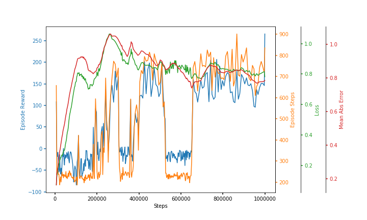

# Deep RL Quadcopter Controller

*Teach a Quadcopter How to Fly!*

## Project file structure

After creating a working version of the learning Agent with a Critic and and Actor it was decided to make use of [keras-rl](https://github.com/keras-rl/keras-rl), or `keras-rl`, as the Agent environment and to contribute to its development by including a FloydHub logging output callback for FLoydHub training  metrics plotting. Using keras-rl required a working version of the copter in [Open AI gym](https://gym.openai.com/), or `gym`. Local modified `git` repositories of `keras-rl` and `gym` were created for training.

The final learning agent is the script file `ddpg_quadcopter.py`. A command line interfaces was integrated into this script for easy hyper-parameter tuning on FloyHub or any other CLI.

The  `ddpg_quadcopter` resides in the exam submission `git` repository called [Quadcopter-Project](https://github.com/justinsolms/Quadcopter-Project.git). The modified training `keras-rl` and `gym` repositories are each a [submodule](https://git-scm.com/docs/git-submodule) of the Quadcopter-Project repository.

The final submission Jupyter notebook is `Quadcopter_Project.ipynb`.

## Environment

The simulation environment is a box on the ground 50m meters in height and 100 meters wide in the horizontal. The box may be viewed as a box centered around a point on the ground from which all the walls are 50 meters away.

The Quadcopter is terminated of it crashes into the walls of the box or the ground.

The quadcopter simulatioin step is 1/50th of a second or 0.02 seconds.

## Dynamics bug

The copter physics file improperly attributed the drag vector. I made a fix that has been posted at [GitHub repository](https://github.com/justinsolms/RL-Quadcopter-2.git) with the fix. I also reported this to my mentor.

## The quiescent state

The Quadcopter was modified to have a mean thrust of 403.93 as well as a 0.5 linear deviation on all rotors, providing almost exactly a counterbalance to gravity. This provided stationary level hover conditional to zero action, i.e., disconnected form the Actor. The Quadcopter also initialized in a uniformly random position.

## Training initial state

The training commenced with the random position.  All angles, velocity and angular velocity were made zero or else there was always a very short flight before a crash/termination.

## Quadcopter

The quadcopter enviroment `QuadCopter-v0` and it's reward function is to be found at [./gym/gym/envs/classic_control/quad_copter.py](./gym/gym/envs/classic_control/quad_copter.py).

### Training flight behavior

With the Actor engaged with Ornstein-Uhlenbeck noise and the Actor final layer initialized to a normal distribution, usually of $\sigma-0.0001$, there was always a gradual tilt away form level flight resulting in a loss of altitude and sideways acceleration which resulted in early crash/termination of flight.

Here are some samples from a 10,000 step warm-up phase.

Episode  | Episode Steps | Episode Reward
---------|---------------|---------------
1        | 756           | 209.762
2        | 669           | 70.518
3        | 536           | 89.581
4        | 554           | 51.152
5        | 866           | 369.149
6        | 796           | 96.979
7        | 1156          | 126.055
8        | 1111          | 398.637
9        | 629           | 23.819
10       | 716           | 219.107
11       | 412           | 41.921
12       | 767           | 217.698
13       | 670           | 34.765
14       | 553           | 52.846
**Mean** | **727.93**    | **143**

This deteriorates significantly the moment the Actor and Critic are finished with their war-up and become engaged. A training metric plot is shown.

The final result is that the Quadcopter has longer duration episodes and better rewards.

### State

The provides state is the earth-frame position $\boldsymbol{r}^n$, the flattened earth-to-body direction cosine matrix $C^b_n$, the earth-frame velocity $\boldsymbol{v}^n$, the body frame angular rotation $\boldsymbol{\omega}^b$. Linear and acceleration were fund to be necessary too. This resulted in a 24-dimensional state observation vector. The direction cosine was used as a state-to-feature transformation as the angular state has three mathematical  step discontinuities and a singlarity at pitch, $\theta=\pm90\degree$ and so a DCM was preferred.

### Quaternion recommendation

The angular velocities and acceleration also possesses these same steps and singularities. Quaternions shall be used for all angular components in both the Quadcopter simulation as well as the state observations to overcome these problems.

# Reinforcement Learning

### Reward function

The quadcopter enviroment `QuadCopter-v0` and it's reward function is to be found at [./gym/gym/envs/classic_control/quad_copter.py](./gym/gym/envs/classic_control/quad_copter.py).

The step rewards consisted of:

* Reward of 0.8 for flying.
* Penalty of 10 for a crash
* Penalty of $\frac{||\boldsymbol{r}^n - \boldsymbol{r}^n_{center}||_2}{r_{max}}$ to discourage wandering away form the center of the box toward the walls, roof or ground; where $r_{max}$ is box limit and $\boldsymbol{r}^n_{center}$ is the center of the box.
* Penalty of the mean of the square of the off-trace elements of the $C^b_n$ DCM multiplied by the speed $||\boldsymbol{v}^n||_2$ to discourage speedy flying in non-level flight, i.e, avoid being reckless.

### Agent

The agent is to be found at [./ddpg_quadcopter.py](./ddpg_quadcopter.py)

The actor used the arctitechture of the paper [arXiv:1509.02971](https://arxiv.org/abs/1509.02971) _Continuous control with deep reinforcement learning T.Lillicrap et al_. The main difference being that I added two more layers to the end of each network and used 512 units for the 1st layers and 64 for all the rest. Note that the Critic action input is considered a second layer. Actions were not included until the 2nd hidden layer of The Critic as in the paper.

I used ideas from the TORCS project of [Ben Lau](https://yanpanlau.github.io/2016/10/11/Torcs-Keras.html), for the choice of linear activations in the Critic for layers `Q_a1` and `Q_h1` as this improved learning. The TORCS project seemd a good choice as it has more complex dynamics than the pendulum and boxcar environment I debugged my Agent on.

I kept with paper by using the Adam optimizer but I used the TORCS use of Mean Absolute Error.

My choice of hyper-parameters:

 * The discount factor $\gamma$ = 0.99 as in the paper.
 * The soft update $\tau$ = 0.001 as in the paper.
 * The Ornstein-Uhlenbeck process I set $\mu$=0.0, $\theta$=2.0, $\sigma$=0.1 as I needed greater bandwidth (less correlation) in the process, although I think the variance may be too high. I would need more runs to discover this. If this $\theta$ was not high the copter tended to wobble allot.
 * I initialized the Actor output layers weights and bias to a normal $\sigma$ = 0.001 and zero mean to ensure that the intial actions were near zero, similar to the paper. The Critic I did not worry about.

I did not use BatchNormalization as there appears to be a bug when using the TensorFlow back-end in this regard. I need more time to figure this out or use another back-end.

### Metrics

The output text [output.txt](./output.txt) of the run used to produce this report is to be found in this repository.

The task was very difficult. I did not manage to run enough to explore the hyper-parameter space properly. I found that using GPU's (such as FloyHub) ran no faster than my PC probably due to the Quadcopter physics simulation causing the CPU load to starve the GPU. Often a run that did well, when re-run with the exact same hyper-parameters, did not learn at all!!

There was always an _aha-moment_ learning, followed by and _oh-no_ phase, and maybe a repeat or two of this behavior, then finally a definite, _we-got-it_, phase. I did not perform long enough training to find out what happens later on.

Learning appears to proceed in a start-stop fashion in most cases. Eventually the Agent learn to fly. I do not have metrics to demonstrate the exact nature of the flying. I only have the episode rewards and episode steps achieved.

The metrics below have been re-sampled down by a factor of 10 whilst preserving the time steps information.

I used Mean Abolute Error as my optimizer metric and monitored the Critic loss(mse) and mean episode reward during training.

# Testing final performance

The output text [output.txt](./output.txt) of the run used to produce this report is to be found in this repository.

Post-train testing for 5 episodes was performed with no noise process.

Episode  | Episode Steps | Episode Reward
---------|---------------|---------------
1        | 1500*         | 899.536
2        | 1285          | 450.448
3        | 1500*         | 676.301
4        | 1500*         | 514.441
5        | 1424          | 377.892
**Mean** | **1441.80**   | **583.72**

**Note:** The `*`-marked episodes are where the Episode Step reached the maximum allowed by the environment.

This far exceeds that of the above tabled pre-training 10,000 step warm-up phase, with 3 of the 5 episodes reaching the maximum allowed steps for an episode. It can be assumed that the Quadcopter Agent has begun to learn to fly in a hovering flight for at 1500 steps (or 30 seconds).

As the training ran only 1,000,000 steps it can be assumed that more training would be beneficial, as well as exploring the hyper-parameter space in greater depth.

# Conclusion

A hard part was getting the Quadcopter to fly properly for training as it had a bug. Then small bugs in my network I just did not see. Like connecting to the layer above the layer above it -!%?!@?

But by far the hardest was the reward function. I would like to apply the Ricatti, quadratic-control equations to setting up a reward function as I think that would be beneficial in achieving stability. I think that this would only be feasible for low degree of freedom robots such as the quad-copter.

I wish I could say more about anything interesting in how the Quadcopter or my agent behaved. I wish I could visualize it properly, but I did not have time to write the visualization callback in `keras-rl`.

I do know that with some full training sessions the Agent learned to just leave the Quadcopter alone as much as possible as it was stable to begin with. I added more Ornstein-Uhlenbeck noide to fic that. Other time the Agent thought that zooming past the middle of the box anyway it could constituted a minimization of $||\boldsymbol{r}^n - \boldsymbol{r}^n_{center}||_2$ over an episode. I added the penalty of the mean of the square of the off-trace elements of the $C^b_n$ DCM multiplied by the speed $||\boldsymbol{v}^n||_2$ to discourage speedy flying in non-level flight, i.e, avoid being reckless. That fixed that wild behavior!

I would also definitely use quaternions as described earlier.

Mostly I would reduce simulation time by off-line batch training the Critic with a huge amount of pre-recorded Quadcopter random flights. The idea would be to start with an okay'ish to good Critic from the start. I would also simulate have to solve the issue that it may be the physics simulation slowing down the CPU and starving the GPU.
